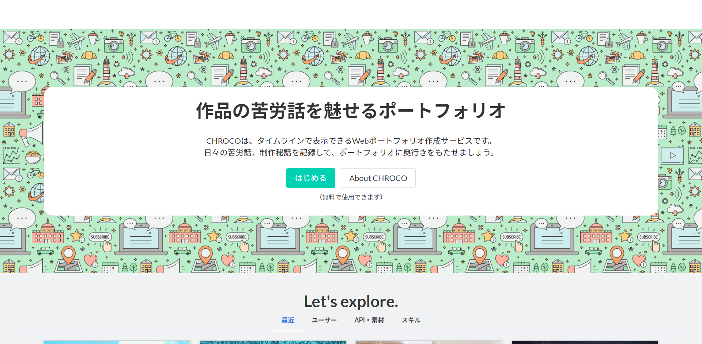

# feature-requests
CHROCO（クロコ）は作品のストーリーを掘り下げることのできるタイムライン型ポートフォリオです。
# CHROCO――ポートフォリオをストーリーで語る

> このリポジトリは、[CHROCO](https://chroco.ooo)の機能リクエストや開発状況をまとめる目的で運用されています。

- [CHROCOの開発状況はこちら](https://github.com/orgs/chroco-ooo/projects/1?fullscreen=true)

## GitHub アカウントをお持ちの方へ

[Issues](https://github.com/chroco-ooo/feature-requests/issues)にて、以下を受け付けています。

- **機能リクエスト**: どんな機能? どんなユーザ向け? など記入
- **バグ報告**: バグの発生するURL、発生状況など記入

※質問についてはお受けできませんので、こちらの[お問い合わせ](https://docs.google.com/forms/d/e/1FAIpQLSdK3OXf6UyLJir50Gyrp8tMpwrRaZl7Fl1gWlVaLiUa6PERrA/viewform?vc=0&c=0&w=1)の方にお願いします。
